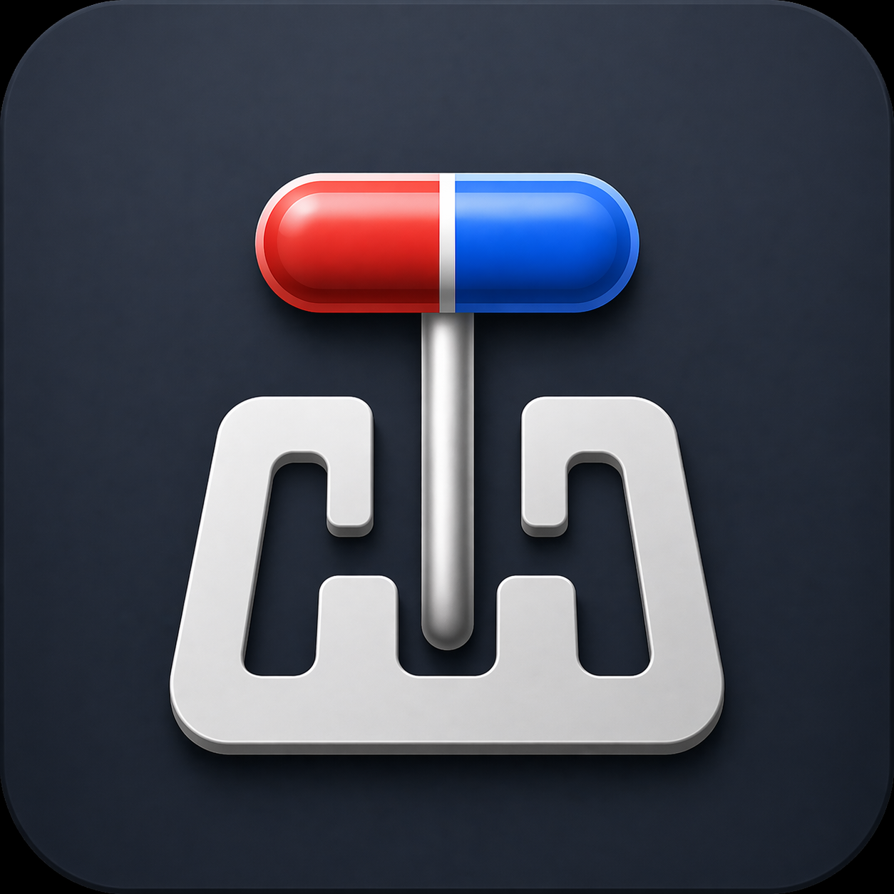

# TransSync

  

  <b>Android 高颜值液态玻璃远程下载管理器</b> 
  <b>Modern Remote Download Manager for Android</b>

  
  
  
  

  <b>语言选择 / Language:</b> 
  <a href="#-简体中文">简体中文</a> • <a href="#-english">English</a>

---

## 🇨🇳 简体中文

### 📖 简介

**TransSync** 是一款基于 Jetpack Compose 构建的现代 Android 远程下载管理器。完美原生兼容 **Transmission** 与 **qBittorrent** 两大主流下载客户端，独创 **Liquid Glass（液态玻璃）UI 视觉架构**，提供极致平滑的交互体验与智能的 H&R 自动化管理。

---

### ✨ 核心特性

#### 🚀 双客户端引擎支持
- **原生双引擎适配**：完美支持 Transmission RPC 与 qBittorrent Web API v2。
- **极速无缝切换**：切换服务器时自动识别客户端类型，跨客户端自重启确保 100% 内存干净生效。

#### 🎨 独创液态玻璃 UI 架构
- **物理折射 Shader 卡片**：搭载 1:1 拟真凸透镜折射 Shader 与 120 FPS 动态高斯模糊卡片。

#### ⏳ H&R 自动化生命周期
- **下载完成自动重汇报**：种子下载完成时自动向 Tracker 发送 Reannounce，即刻起算做种。
- **倒计时归零 10 分钟重汇报**：H&R 考核时间归零后 10 分钟自动二次汇报，确保 PT 站状态精准刷新。
- **缓冲期满系统通知**：30 分钟缓冲期满并显示绿色勾选图标时，发送系统通知提醒考核通过。

#### 🔒 隐私保护与自定义 Tracker 映射
- **一键隐私模式**：智能遮罩敏感情报与 Tracker 域名。
- **自定义映射备份与恢复**：支持 `.ini` 文件一键导入恢复与增量备份。

#### ⚡ 备用网速与在线更新
- **一键龟速模式**：调起 Transmission 与 qBittorrent 全局备用限速。
- **GitHub Releases 在线更新**：自动与 GitHub Releases 版本对比，推送更新升级弹窗。

---

### 🛠️ 安装与使用

1. 从 [GitHub Releases](https://github.com/kuangru52/TransSync/releases/latest) 页面下载最新的 `TransSync-v3.08.apk` 文件。
2. 在 Android 手机（Android 8.0+）上安装并打开应用。
3. 输入你的 Transmission 或 qBittorrent 服务器地址、端口及凭据，点击【测试连接】与【保存】即可开始使用！

---

## 🇺🇸 English

### 📖 Introduction

**TransSync** is a modern, high-performance remote download manager for Android built with Jetpack Compose. It natively supports both **Transmission** and **qBittorrent** Web API v2, featuring a custom **Liquid Glass UI design system** and automated H&R lifecycle management.

---

### ✨ Key Features

#### 🚀 Dual Client Support
- **Native Dual-Engine**: Full support for both Transmission RPC and qBittorrent Web API v2.
- **Seamless Server Switching**: Automatically handles cross-client switching (Transmission ↔ qBittorrent) with instant clean session reloading.

#### 🎨 Liquid Glass UI Architecture
- **Realistic Refraction Shader**: Built with custom 1:1 lens refraction shaders and real-time 120 FPS Gaussian blur cards.

#### ⏳ Automated H&R Lifecycle
- **Auto Reannounce on Complete**: Automatically reannounces to trackers as soon as download finishes.
- **Post-H&R Reannounce**: Automatically reannounces 10 minutes after required seeding time ends to ensure PT site status is updated.
- **H&R Passed Notification**: Sends system notification when the 30-minute cooling buffer expires.

#### 🔒 Privacy & Custom Tracker Mappings
- **Privacy Mode**: One-tap blur for sensitive torrent metadata and tracker domains.
- **Tracker Mapping Backup & Restore**: Full `.ini` format backup and incremental restore support.

#### ⚡ Speed Limits & Auto Updates
- **One-Tap Alternative Speed Limits**: Native toggle for alternative speed limits mode (turtle icon).
- **GitHub Auto Update Checker**: Automatically checks latest GitHub Releases and prompts updates.

---

### 🛠️ Installation

1. Download the latest `TransSync-v3.08.apk` from [GitHub Releases](https://github.com/kuangru52/TransSync/releases/latest).
2. Install and launch the application on your Android device (Android 8.0+).
3. Enter your Transmission or qBittorrent server URL and credentials, test connection, and save!

---

## 📄 开源协议 / License

本项目采用 [Apache License 2.0](LICENSE) 开源协议。

This project is licensed under the [Apache License 2.0](LICENSE).
