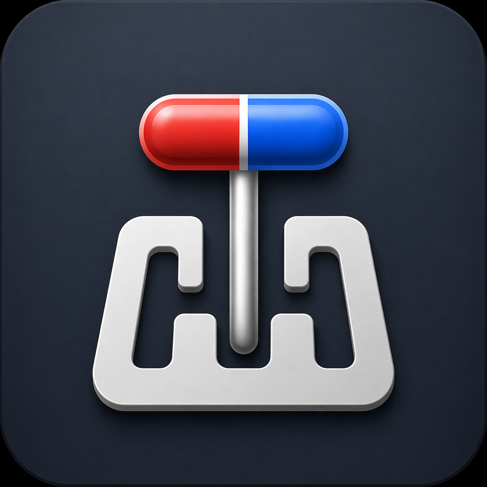

# TransSync

  

  <b>Android 高颜值 3D 液态玻璃远程下载管理器</b> 
  <b>Modern 3D Liquid Glass Remote Download Manager for Android</b>

  
  
  
  

  <b>语言选择 / Language:</b> 
  <a href="#-简体中文">简体中文</a> • <a href="#-english">English</a>

---

## 🇨🇳 简体中文

### 📖 简介

**TransSync** 是一款基于 Jetpack Compose 构建的现代 Android 远程下载管理器。原生完美兼容 **Transmission** 与 **qBittorrent** 两大主流下载客户端，独创 **3D AGSL Liquid Glass（液态玻璃）UI 视觉架构**，提供极致流畅的交互体验、全平台 PT 站浏览器唤起及 H&R 自动化生命周期管理。

---

### ✨ 核心特性

#### 🚀 1. 双客户端引擎与多服务器切换
- **原生双引擎适配**：完美支持 Transmission RPC 与 qBittorrent Web API v2。
- **多服务器无缝平滑管理**：支持添加/编辑/删除多个 Transmission 或 qBittorrent 服务器，自定别名与圆头像图标，支持一键无缝切换活动服务器。

#### 🎨 2. 独创 3D AGSL 液态玻璃 UI 架构
- **物理凸透镜折射 Shader**：基于 Android 13+ AGSL 自定义着色器，1:1 物理模拟凸透镜折射与高斯模糊（可调节折射率、深度、高斯模糊度、白点高光与饱和度）。
- **沉浸式动态壁纸**：支持 Bing 每日精选壁纸、本地图片多图轮播与实时高斯模糊调参。
- **全端响应式适配**：完美适配手机竖屏与平板/折叠屏大屏双栏布局，控件悬浮对齐。

#### 🌐 3. PT 站浏览器一键唤起下载 (`transsync://`)
- **Deep Link 极速唤起**：支持通过 `transsync://download?url=...` 协议直接拉起 App 并自动弹出 3D 玻璃添加种子对话框。
- **Tampermonkey 油猴脚本支持**：提供项目内置油猴脚本 `transsync.user.js`，适配 M-Team、TTG、NexusPHP 等主流 PT 站，一键传输 Passkey 直链至 App。

#### ⏳ 4. H&R 自动化生命周期管理
- **下载完成自动重汇报**：任务完成时自动向 Tracker 发送 Reannounce 重新汇报，即刻起算做种时长。
- **H&R 考核时间归零二次汇报**：H&R 时间归零 10 分钟后自动发送二次汇报，确保 PT 站考核状态及时刷绿。
- **完成提醒与通知**：考核通过并出现绿色勾选状态后自动推送系统通知。

#### 🔒 5. 隐私保护与配置导入导出
- **一键隐私模式**：模糊/遮罩敏感种子名称与 Tracker 域名，保护截图隐私。
- **自定义 Tracker 映射**：一键设置自定义域名标签映射，支持 `.ini` 格式配置文件的备份导出与增量恢复。

---

### 🛠️ 安装与使用

1. 从 [GitHub Releases](https://github.com/kuangru52/TransSync/releases/latest) 下载最新的 `TransSync-v4.25.apk`。
2. 在 Android 设备（Android 8.0+）上安装并打开应用。
3. 输入你的 Transmission 或 qBittorrent 服务器地址与凭据，点击【测试连接】并保存即可。
4. 如需在 PT 站网页中一键唤起下载，安装项目根目录下的 `transsync.user.js` 脚本即可。

---

## 🇺🇸 English

### 📖 Introduction

**TransSync** is a modern, high-performance remote download manager for Android built with Jetpack Compose. It natively supports both **Transmission** and **qBittorrent** Web API v2, featuring a custom **3D AGSL Liquid Glass UI design system**, cross-app Deep Link integration, and automated H&R lifecycle management.

---

### ✨ Key Features

#### 🚀 1. Dual Client Engine & Multi-Server Management
- **Native Dual-Engine**: Full support for Transmission RPC and qBittorrent Web API v2.
- **Multi-Server Switching**: Seamlessly manage multiple Transmission or qBittorrent servers with custom aliases, avatars, and instant 1-tap switching.

#### 🎨 2. 3D AGSL Liquid Glass Design System
- **Convex Lens Refraction Shader**: Built with AGSL shaders for real-time 3D lens refraction and 120 FPS Gaussian blur (customizable refraction, depth, blur radius, white point, and saturation).
- **Immersive Wallpapers**: Bing Daily Wallpaper support, local slideshows, and real-time blur adjustments.
- **Adaptive Responsive Layout**: Optimized for both phone portrait mode and tablet/foldable two-pane landscape layouts.

#### 🌐 3. Browser One-Tap Deep Link (`transsync://`)
- **Deep Link Integration**: Supports `transsync://download?url=...` scheme to directly launch the app and open the pre-filled 3D glass Add Torrent dialog.
- **Tampermonkey UserScript**: Includes `transsync.user.js` in project root for M-Team, TTG, and NexusPHP PT sites.

#### ⏳ 4. Automated H&R Lifecycle
- **Auto Reannounce on Completion**: Automatically sends reannounce requests when a download finishes to start seeding timers immediately.
- **Post-H&R Secondary Reannounce**: Automatically reannounces 10 minutes after H&R timer expires.
- **System Notifications**: Sends notifications when H&R status turns green.

#### 🔒 5. Privacy & Tracker Mappings
- **Privacy Mode**: One-tap blur for sensitive torrent titles and tracker domains.
- **Tracker Mapping Backup & Restore**: Full `.ini` format backup export and incremental restore support.

---

### 🛠️ Installation

1. Download the latest `TransSync-v4.25.apk` from [GitHub Releases](https://github.com/kuangru52/TransSync/releases/latest).
2. Install and launch the application on your Android device (Android 8.0+).
3. Enter your Transmission or qBittorrent server URL and credentials, test connection, and save!

---

## 📄 开源协议 / License

本项目采用 [Apache License 2.0](LICENSE) 开源协议。

This project is licensed under the [Apache License 2.0](LICENSE).
